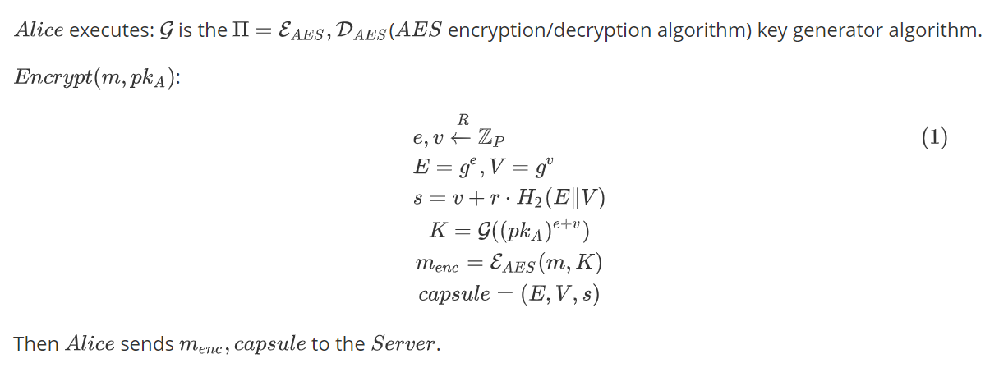
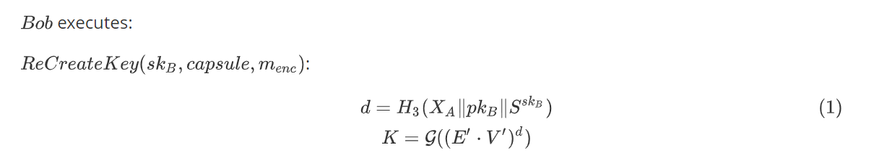

# Project Description

This project implements a data secure sharing system based on Proxy Re-Encryption (PRE). Through the PRE technology, the data provider (Alice) can delegate the decryption authority of the encrypted data to the proxy server. The proxy server re-encrypts the ciphertext, allowing the data receiver (Bob) to decrypt the data using his own private key without directly obtaining Alice's private key. 

# Introduction and Theory


## Prerequisites


## Encrypt



## ReKeyGen


## ReEncryption


## ReCreateKey



## Decrypt


# Getting started

Below is a description of the components of this project:
- **`curve.py`**: Defines elliptic curve-related operations, including key generation and point operations.
- **`math_utils.py`**: Provides utility functions for large integer operations, such as addition, multiplication, and inversion.
- **`recrypt.py`**: Implements the core logic of proxy re-encryption, including key generation, encryption, re-encryption, and decryption.
- **`utils.py`**: Provides some auxiliary utility functions, such as hash calculation and key format conversion.
- **`main.py`**: The main entry file of the project, demonstrating how to use the above modules to complete the data encryption, re-encryption, and decryption processes.

## File Structure
```
Proxy-Re-encryption/
│  a.txt
│  curve.py
│  main.py
│  math_utils.py
│  recrypt.py
│  requirements.txt
│  utils.py
│
└─assets
        1.png
        2.png
        3.png
        4.png
        5.png
        6.png
        7.png
```

## Installation
Download our source code:
```bash
git clone https://github.com/Egbert-Lannister/Proxy-Re-encryption.git
```

This project depends on Python libraries `ecdsa` and `cryptography`. Please install them before running the project:
```bash
pip install -r requirements.txt
```

## Running the Project
1. Ensure that the required dependencies are installed.
2. Run the following command in the project root directory to start the program:
```bash
python main.py
```

## Testing
Running `main.py` will produce output similar to the following:
```
origin message: Hello, Proxy Re-Encryption!
old key: 46e1e518c3b4f0f2dc794402f890b60dbc70b345c7e28d5e26a233487e1785d2
capsule before encode: Capsule(E=0429ed7776bf47ebd81f4480c86281cd29747f223a5d748428d9c2b95844e8472d006c8218c14b5b0d55b2169356baa10b77e2b035b03355dde6235a64e786d5cd, V=04582f0b930641e5788a9738625d3acabd3e5d4841410dd3d970cfa9b1a0a00b732380bdd42e15f39f50cc5b67d9e62e49b52bb56157f8660991452f34b823e7bd, s=11392115764805277898723039736050930053331762900176272070606892616715792250255)
capsule after decode: Capsule(E=0429ed7776bf47ebd81f4480c86281cd29747f223a5d748428d9c2b95844e8472d006c8218c14b5b0d55b2169356baa10b77e2b035b03355dde6235a64e786d5cd, V=04582f0b930641e5788a9738625d3acabd3e5d4841410dd3d970cfa9b1a0a00b732380bdd42e15f39f50cc5b67d9e62e49b52bb56157f8660991452f34b823e7bd, s=11392115764805277898723039736050930053331762900176272070606892616715792250255)
cipherText: dc6d0bc558a021975939a83733b04d44243e78f5bae1415650ca7875f2c3601d839754e97a97da88873502
recreate key: 46e1e518c3b4f0f2dc794402f890b60dbc70b345c7e28d5e26a233487e1785d2
rk: 82970487910868983314075749017104933245082592912625539314325623421814599680005
plainText: Hello, Proxy Re-Encryption!
PlainText by my own private key: Hello, Proxy Re-Encryption!
```

## References
### Papers
- Matt Blaze, Gerrit Bleumer, and Martin Strauss. [Divertible Protocols and Atomic Proxy Cryptography](https://doi.org/10.1007/BFb0054122). In *Advances in Cryptology — EUROCRYPT '98*, Lecture Notes in Computer Science, vol 1403. Springer, Berlin, Heidelberg, 1998.

### Blogs
- Proxy Re-Encryption Principles and Practice: [https://www.cnblogs.com/informatics/p/18131941](https://www.cnblogs.com/informatics/p/18131941)
- Introduction to Proxy Re-Encryption: [https://juejin.cn/post/7308905139406782483](https://juejin.cn/post/7308905139406782483)

## Citations
```bibtex
@inproceedings{blaze1998divertible,
  title={Divertible protocols and atomic proxy cryptography},
  author={Blaze, Matt and Bleumer, Gerrit and Strauss, Martin},
  booktitle={International conference on the theory and applications of cryptographic techniques},
  pages={127--144},
  year={1998},
  organization={Springer}
}
```

```bibtex
@InProceedings{10.1007/BFb0054122,
    author="Blaze, Matt
    and Bleumer, Gerrit
    and Strauss, Martin",
    editor="Nyberg, Kaisa",
    title="Divertible protocols and atomic proxy cryptography",
    booktitle="Advances in Cryptology --- EUROCRYPT'98",
    year="1998",
    publisher="Springer Berlin Heidelberg",
    address="Berlin, Heidelberg",
    pages="127--144",
    abstract="First, we introduce the notion of divertibility as a protocol property as opposed to the existing notion as a language property (see Okamoto, Ohta [OO90]). We give a definition of protocol divertibility that applies to arbitrary 2-party protocols and is compatible with Okamoto and Ohta's definition in the case of interactive zero-knowledge proofs. Other important examples falling under the new definition are blind signature protocols. We propose a sufficiency criterion for divertibility that is satisfied by many existing protocols and which, surprisingly, generalizes to cover several protocols not normally associated with divertibility (e.g., Diffie-Hellman key exchange). Next, we introduce atomic proxy cryptography, in which an atomic proxy function, in conjunction with a public proxy key, converts ciphertexts (messages or signatures) for one key into ciphertexts for another. Proxy keys, once generated, may be made public and proxy functions applied in untrusted environments. We present atomic proxy functions for discrete-log-based encryption, identification, and signature schemes. It is not clear whether atomic proxy functions exist in general for all public-key cryptosystems. Finally, we discuss the relationship between divertibility and proxy cryptography.",
    isbn="978-3-540-69795-4"
}

```

## Author Information
**Egbert Lannister**  
[Egbert Lannister](https://github.com/freegbtest)  

If you find any issues, you can report them to us through the issue tracking system on GitHub.

## LICENSE
This project is licensed under the [MIT License](LICENSE).